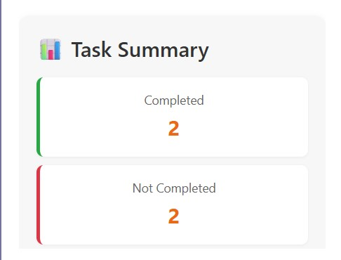
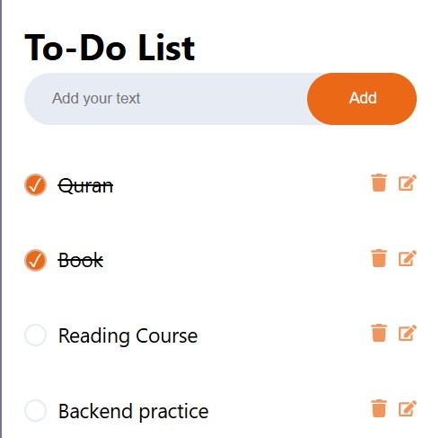

# ✅ Todo App – React + LocalStorage

A simple and responsive Todo List app built using **React**. Add, edit, delete, and complete tasks — with data saved in your browser using `localStorage`.

## 🌐 Live Demo
🔗 [View the App on Vercel](https://todo-react-app-henna-five.vercel.app/)

## ✨ Features

- ✅ Add new tasks
- ✏️ Edit existing tasks
- ❌ Delete tasks
- ✔️ Toggle task completion
- 💾 Saves to `localStorage`
- 🔘 Custom checkbox styling with icons
- 📊 Task summary: total, completed, not completed, all/any complete
- 🖥 Responsive UI for mobile & desktop

## 📦 Folder Structure

react-todo-app/
├── public/
│   └── index.html
├── src/
│   ├── components/
│   │   ├── TodoForm.js
│   │   └── TodoList.js
│   ├── App.js
│   ├── App.css
│   └── index.js
├── README.md
└── 

## 🛠️ Built With
- React (Hooks: useState, useEffect)
- HTML5 & CSS3
- JavaScript ES6
- LocalStorage API

## 📸 Screenshots

### 📋 Task Summary UI

### 🧾 To-Do List Interface

## 📁 Deployment
This app is deployed on **Vercel** at the link above.

## 📄 License

This project is open-source and free to use.

## 🙋 Author

Made with ❤️ by **Abdukadir Hilowle**  
GitHub: [@abdukadir037](https://github.com/icabduqaadir12)